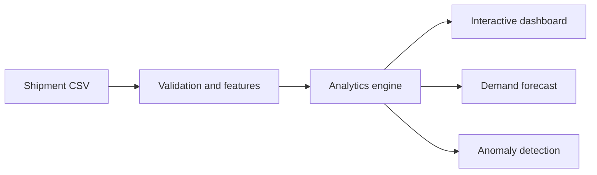

# LogiScope Analytics

An end-to-end supply-chain analytics platform that turns raw shipment records into operational insights, carrier benchmarks, anomaly alerts and a 14-day demand forecast.

## Features

- Executive KPI dashboard with interactive filters
- Carrier cost/reliability scorecards
- Route and shipment-volume analytics
- Machine-learning demand forecasting (Random Forest)
- Unsupervised cost and delivery anomaly detection (Isolation Forest)
- CSV upload, validation, exploration and export
- Synthetic logistics dataset with 2,500 shipments
- Automated tests, Docker support and CI pipeline

## Tech stack

Python, Streamlit, Pandas, Plotly, scikit-learn, Pytest, Docker and GitHub Actions.

## Quick start

```bash
python -m venv .venv
source .venv/bin/activate
pip install -r requirements.txt
streamlit run app/dashboard.py
```

Open `http://localhost:8501`.

## Run with Docker

```bash
docker compose up --build
```

## Tests

```bash
pytest -q
```

## Dataset schema

Upload a CSV containing: `shipment_id`, `order_date`, `origin`, `destination`, `carrier`, `distance_km`, `weight_kg`, `shipping_cost`, `planned_days`, `actual_days`, and `status`.

## Architecture



## License

MIT

